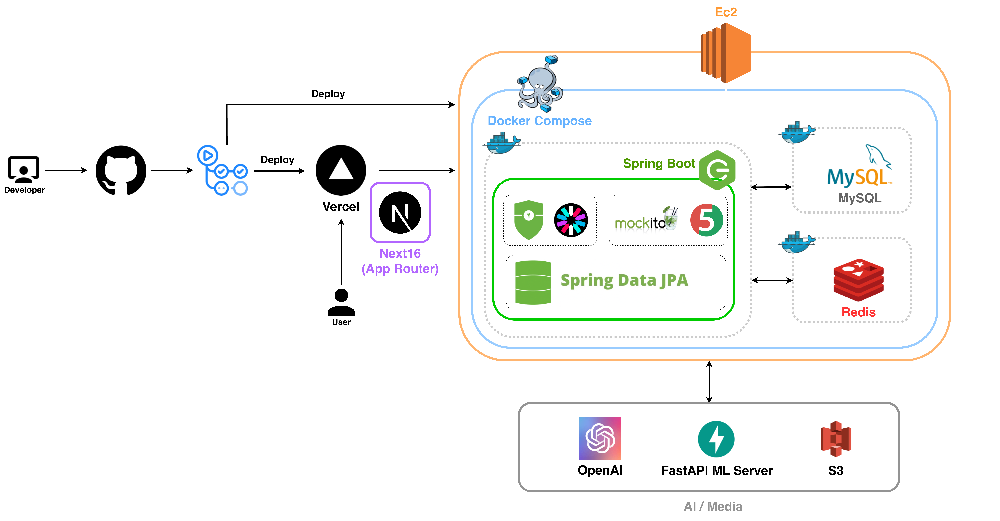

# KKEBI Clinic Counselor Web

상담사가 내담자 상태, 위험 신호, 세션 자동기록을 한 곳에서 확인하고 세션 기록과 리포트를 생성·관리하는 상담사 전용 포털.

## Tech Stack

- Framework: Next.js 16 (App Router), React 19,
- Language: TypeScript
- State Management: TanStack Query
- UI: Tailwind CSS v4, Radix UI primitives
- Form/Validation: React Hook Form
- Test: Vitest, Testing Library, Playwright
- Tooling: ESLint, Prettier, Husky, lint-staged
- API Schema & Types: openapi-typescript
- i18n: next-intl

## Architecture



## Features

| Category           | Scope                                                                      |
| ------------------ | -------------------------------------------------------------------------- |
| Authentication     | 상담사 로그인, 2FA 인증, 비밀번호 재설정, 권한 기반 화면 진입 및 세션 관리 |
| Dashboard          | 오늘 일정, 위험 신호, 주간 통계 모니터링                                   |
| Client Management  | 내담자 목록 조회, 상세 정보 확인, 신규 등록, 종결/복원/상태 관리           |
| Session Operations | 세션 생성, 일정 변경, 시작/진행/완료 흐름, 자동기록 기반 인사이트 확인     |
| Summary & Reports  | 세션 요약 작성/제출, 리포트 생성 및 다운로드                               |
| Localization       | 다국어 라우팅 및 메시지 관리 (`/ko`, `/en`)                                |

## Commands

- Node.js 20+
- pnpm 9+

```bash
pnpm install

# Run
pnpm dev                # dev server (http://localhost:3000)
pnpm build              # production build
pnpm start              # production server

# Quality
pnpm lint               # eslint
pnpm format             # prettier
pnpm test               # 전체 테스트 실행 (unit + e2e)
pnpm test:unit          # 단위 테스트 실행 (Vitest)
pnpm test:e2e           # E2E 테스트 전체 실행 (Playwright)
pnpm test:e2e:smoke     # 핵심 smoke E2E 시나리오 실행
pnpm test:e2e:critical  # critical E2E 시나리오 실행
pnpm test:e2e:ui        # Playwright UI 모드로 E2E 실행

# Utilities
pnpm generate:types   # openapi -> src/shared/api/generated-types.ts
pnpm i18n:sync        # /tmp/i18n_sheet.csv 기준 번역 동기화
```

## Environment Variables

`.env.local`:

```bash
API_BASE_URL=
NEXT_PUBLIC_API_BASE_URL=
```

## Project Structure & Architecture Principles

### Structure Overview

```text
src/
├── app/                      # 라우팅/페이지/레이아웃/BFF API
│   ├── [locale]/             # 사용자 페이지 라우트 그룹
│   └── api/v1/               # 백엔드 프록시 API 라우트
├── widgets/                  # 페이지 단위 UI 조합
├── features/                 # 기능 단위 비즈니스 로직
├── entities/                 # 도메인 엔티티 타입/모델
├── shared/                   # 전역 재사용 모듈
├── i18n/                     # next-intl 설정
└── proxy.ts                  # 로케일 미들웨어 엔트리

messages/
├── ko.json
└── en.json

scripts/
└── sync-i18n-from-csv.mjs
```

### Architecture Principles

- 허용: `app -> features -> shared`, `features -> shared`
- 금지: `shared -> features/app`
- 클라이언트 API 호출은 `src/shared/api/http-client.ts`를 통해 수행
- 서버 프록시는 `src/shared/server/backend-proxy.ts`를 사용
- 인증 토큰은 메모리 스토어 기반이며, 리프레시 플로우는 BFF 라우트를 통해 처리

## i18n Guide

- 로케일 prefix 기반 라우팅: `/ko`, `/en`
- 사용자 노출 텍스트 변경 시 `messages/ko.json`, `messages/en.json` 동시 반영
- 번역 키 추가/수정 후 ko/en parity를 확인

## Branch Strategy

```text
main
 └── dev
      ├── feat/{slug}
      ├── fix/{slug}
      ├── chore/{slug}
      └── style/{slug}
```

- 모든 작업 브랜치는 `dev`에서 분기
- 완료 브랜치는 `dev`로 병합
- 배포 시점에만 `dev`를 `main`으로 병합

## Commit Message Rules

Allowed types:

```text
feat: 새로운 기능 추가
fix: 버그 수정
refactor: 동작 변경 없이 구조 개선
style: 코드 포맷/스타일 수정 (로직 변경 없음)
docs: 문서 작성/수정
chore: 빌드, 설정, 의존성, 스크립트 등 기타 작업
test: 테스트 코드 추가/수정
```
